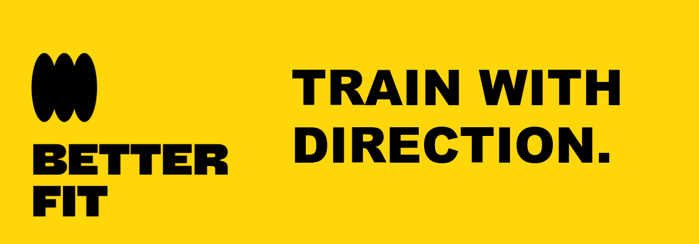
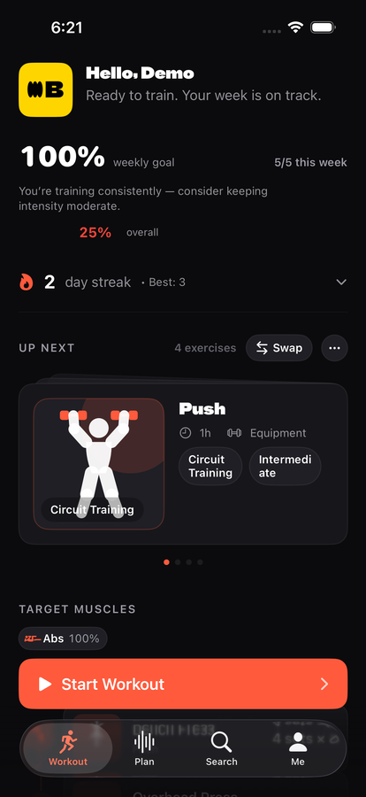
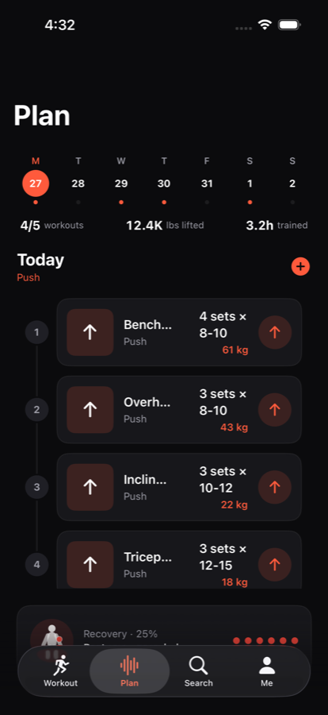
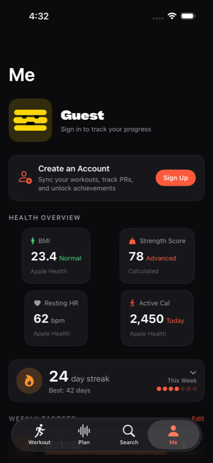

<p align="center">
  
</p>

<p align="center"><strong>A personal strength-training coach that turns performance and recovery into a clear next action.</strong></p>

<p align="center">
  <a href="#a-look-inside">Inside the app</a> ·
  <a href="#design-language">Design language</a> ·
  <a href="#architecture">Architecture</a> ·
  <a href="#run-the-apps">Run the apps</a>
</p>

---

## Your next workout, first

<p align="center">
  
</p>

<p align="center"><em>Lead with the next action: the Workout tab opens on what you're about to do.</em></p>

---

## What it is, really

BetterFit is a calm, dark-first training surface for iPhone and Apple Watch. It helps you decide what to train, move through a session with less friction, understand recovery, and keep building momentum. It speaks like a knowledgeable training partner standing nearby: short, direct, and useful. Never a drill sergeant, influencer, clinical dashboard, or neon fitness game.

The interface is built around a single rule: **lead with the next action or conclusion**. Stats are context, never the headline. Recovery is colour *and* text, never colour alone. Identity yellow is reserved for brand moments; ordinary product screens use ember for the one primary action.

---

## A look inside

<table>
  <tr>
    <td width="50%" align="center">
      
    </td>
    <td width="50%" align="center">
      
    </td>
  </tr>
</table>

- **Plan your week and see what's sore.** Today's exercises carry sets and target weight; the body-map companion pairs recovery colour with a written headline.
- **Read your health overview in one glance.** BMI, strength score, resting heart rate, and active calories lead with the value and a short label.

---

## Design language

- **Identity: BetterFit yellow `#FFD60A` + black.** Reserved for high-impact brand moments, launch surfaces, and achievements.
- **Product: near-black `#0B0B0D` + ember `#FF5A3C`.** Calm training screens with one clear primary action.
- **Recovery: blue to green to amber to red.** Semantic status, always paired with a written label.

Yellow gives BetterFit its identity, but it does not flood every screen. The product stays dark and focused so workout information remains easy to scan between sets. Ember marks the action to take next.

---

## What you can do with it

- **Decide what to train.** Recommended sessions pull from your plan, history, equipment, and recovery.
- **Run it on your wrist.** The watchOS companion ships big buttons, sets/reps on the wrist, haptics on set completion, and a rest timer that survives the screen-off state.
- **Adapt as you go.** The AI adaptation engine adjusts volume, intensity, and exercise selection based on what you actually completed.
- **See recovery, not just history.** A full body-map view of muscle recovery with semantic colour and accessible labels.
- **Swap equipment on the fly.** Barbell taken? The equipment swap manager suggests equivalents from what you have available.
- **Reminders that respect you.** Personalised workout reminders with snooze, never shaming, never missable.

---

## Architecture

```
Apps/iOS/
  BetterFitApp/        # SwiftUI host app (iPhone + iPad)
  BetterFitWatchApp/   # SwiftUI watchOS companion
Sources/BetterFit/      # Public SwiftPM library
```

BetterFit ships as a Swift Package. The same `BetterFit` library powers the iOS host app, the watchOS companion, and any future embed of the coach experience.

```swift
import BetterFit

let betterFit = BetterFit(persistenceService: LocalPersistenceService())
let plan = betterFit.planManager.generatePlan(for: .hypertrophy)
betterFit.startWorkout(plan.workouts[0])
betterFit.completeWorkout(plan.workouts[0])
```

The full API surface is documented in [`docs/api.md`](docs/api.md) with usage examples in [`docs/examples.md`](docs/examples.md).

---

## Install (SwiftPM)

```swift
dependencies: [
    .package(url: "https://github.com/echohello-dev/betterfit.git", from: "1.0.0")
]
```

## Run the apps

### iOS

```bash
mise run ios:open       # XcodeGen + open in Xcode
mise run ios:build:dev   # CLI build for the iPhone simulator
```

### Apple Watch

```bash
mise run watch:open     # open the watch target
mise run watch:build
```

See [`docs/README.md`](docs/README.md) for the full setup, troubleshooting, and pipeline scripts.

## Development workflow

```bash
mise install            # install pinned tools (swift, xcodegen, swiftlint, etc.)
mise run lint           # fast style feedback
mise run test           # 95 SwiftPM tests
mise run ios:test:ui    # XCUITest on the iPhone simulator
```

See [CONTRIBUTING.md](CONTRIBUTING.md) for the contributor guide.

---

## License

BetterFit is licensed under a BSD 3-Clause License with branding protection.
You're free to use, modify, and distribute this code commercially, but must
maintain the "BetterFit" branding for deployments over 50 users.

For enterprise white-label licensing, contact: business@echohello.dev

See [LICENSE](LICENSE) for full terms.
