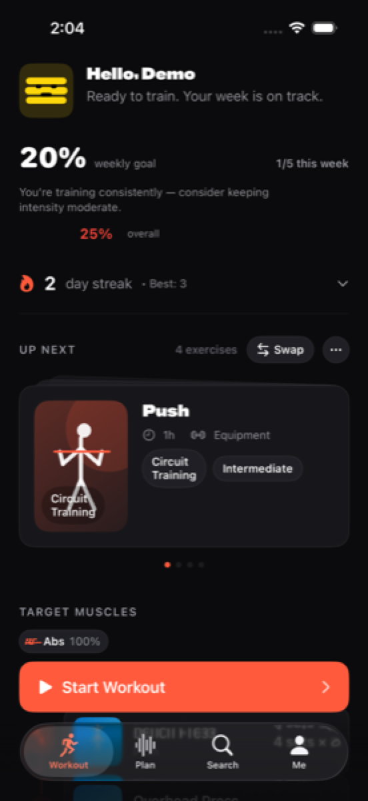
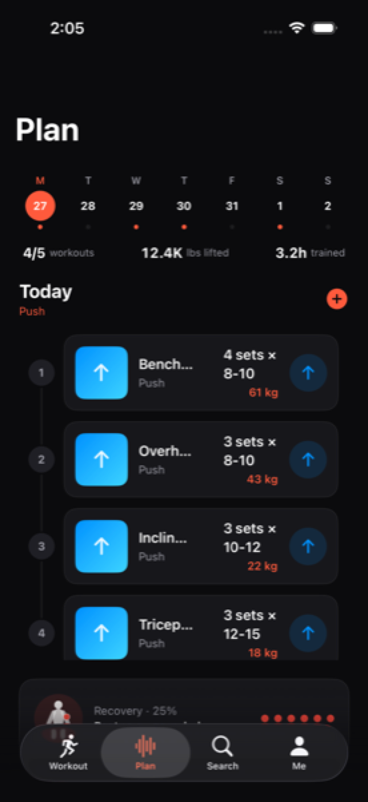

# BetterFit

> **Train with direction. Get better with every session.**
>
> A personal strength-training coach for iPhone and Apple Watch. BetterFit turns workout history, performance, and recovery into a clear next action.

| | |
| --- | --- |
|  |  |
| **Workout home** — the next session, your recovery, and a one-tap start. | **Plan** — your week, today's exercises, and how each muscle is recovering. |
|  | |
| **Profile** — strength score, BMI, streaks, and Apple Health sync. | |

## Why BetterFit

Most training apps spend the first screen on a dashboard. BetterFit spends it on the **next useful action**: start the workout you planned, with the muscle context you need.

- **Lead with the next move.** The Workout tab opens on your next session, not on a metric.
- **Recovery as a colour, never a colour alone.** Body-map dots, rest-day headlines, and muscle status pills always carry a written state.
- **One-handed between sets.** 54pt primary buttons, 44pt minimum tap targets, and short responsive transitions tuned for the gym.
- **Native, calm, dark-first.** iOS 17+ SwiftUI surface with system typography, monospaced digits for changing values, and the BetterFit identity yellow reserved for brand moments only.

## What you can do

| | |
| --- | --- |
| 📱 **Plan a workout** | Recommended sessions pull from your plan, history, equipment, and recovery. Swap an exercise or two when the rack is taken. |
| ⌚ **Run it on Apple Watch** | Big buttons, sets/reps on the wrist, haptics on set completion, and a rest timer that survives the screen-off state. |
| 🤖 **Adapt automatically** | The AI adaptation engine adjusts volume, intensity, and exercise selection based on what you actually completed. |
| 🧭 **See recovery, not just history** | A full body-map view of muscle recovery with semantic colour and accessible labels. |
| 🔁 **Swap equipment on the fly** | Barbell taken? The equipment swap manager suggests equivalents from what you have available. |
| 🔔 **Reminders that respect you** | Personalised workout reminders with snooze, never shaming, never missable. |

## Architecture

```
Apps/iOS/
  BetterFitApp/        # SwiftUI host app (iPhone + iPad)
  BetterFitWatchApp/   # SwiftUI watchOS companion
Sources/BetterFit/      # Public SwiftPM library
```

BetterFit ships as a Swift Package — the same `BetterFit` library powers the iOS host app, the watchOS companion, and any future embed of the coach experience.

```swift
import BetterFit

let betterFit = BetterFit(persistenceService: LocalPersistenceService())
let plan = betterFit.planManager.generatePlan(for: .hypertrophy)
betterFit.startWorkout(plan.workouts[0])
betterFit.completeWorkout(plan.workouts[0])
```

The full API surface is documented in [`docs/api.md`](docs/api.md) with usage examples in [`docs/examples.md`](docs/examples.md).

## Install (SwiftPM)

```swift
dependencies: [
    .package(url: "https://github.com/echohello-dev/betterfit.git", from: "1.0.0")
]
```

## Docs

- [Local development & simulator setup](docs/local-development.md)
- [Authentication setup](docs/auth.md)
- [API reference](docs/api.md)
- [Usage examples](docs/examples.md)
- [TabView patterns (iOS 26)](docs/tabview.md)
- [Architecture decision records](docs/adrs/README.md)
- [Design system](design.md)

## Run the apps

### iOS

```bash
mise run ios:open       # XcodeGen + open in Xcode
mise run ios:build:dev   # CLI build for the iPhone 16 simulator
```

### Apple Watch

```bash
mise run watch:open     # open the watch target
mise run watch:build
```

See [`docs/README.md`](docs/README.md) for the full setup, troubleshooting, and pipeline scripts.

## Development workflow

```bash
mise install            # install pinned tools (swift, xcodegen, swiftlint, etc.)
mise run lint           # fast style feedback
mise run test           # 95 SwiftPM tests
mise run ios:test:ui    # XCUITest on the iPhone simulator
```

See [CONTRIBUTING.md](CONTRIBUTING.md) for the contributor guide.

## License

BetterFit is licensed under a BSD 3-Clause License with branding protection.
You're free to use, modify, and distribute this code commercially, but must
maintain the "BetterFit" branding for deployments over 50 users.

For enterprise white-label licensing, contact: business@echohello.dev

See [LICENSE](LICENSE) for full terms.